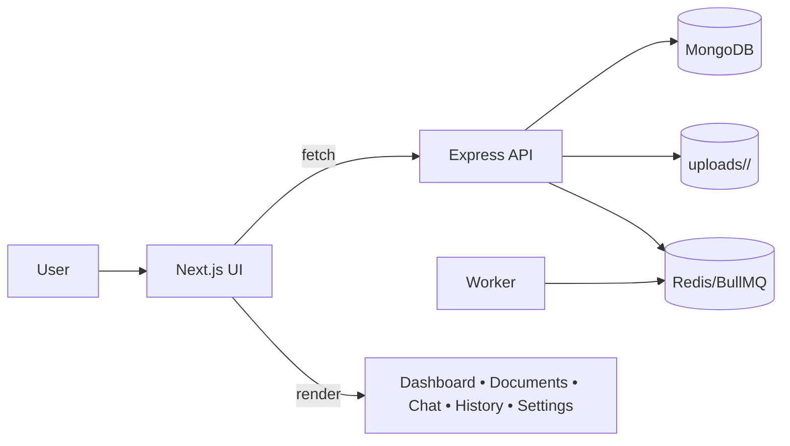
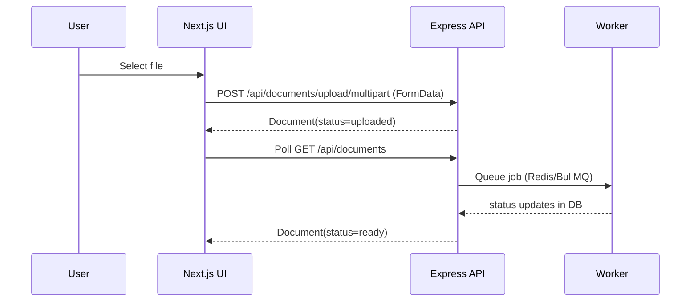
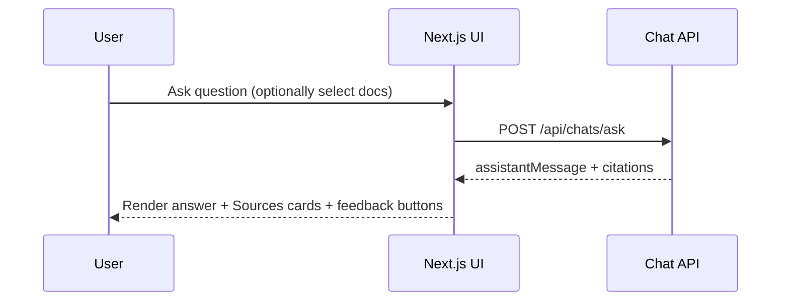

# DocuMind — Frontend

Web application for **DocuMind**, a multi-user document intelligence product: upload PDFs, Word, and PowerPoint files, wait for background processing, then chat with **grounded answers** and **source citations**. Built for the Trao Full-Stack AI Engineering assessment.

**Pair with:** [documind-server](../documind-server) (REST API). If you cloned only this repo, add the backend separately and point `NEXT_PUBLIC_API_URL` at it.

---

## Stack

| Layer | Choice |
|--------|--------|
| Framework | **Next.js** (App Router), **React 19**, **TypeScript** |
| Styling | **Tailwind CSS**, shadcn-style UI primitives |
| Auth | JWT access + refresh; tokens in `localStorage`, session cookie for route guards |
| Data | Native `fetch` wrapper in `src/services/api.ts` (auto-refresh on 401) |

---

## High-Level Architecture (Frontend)



---

## What’s implemented

- **Auth** — Login, signup, protected dashboard routes, session bootstrap via `GET /api/auth/me`
- **Documents** — List, upload (**multipart** `FormData` preferred; JSON base64 still supported), delete, status polling (`uploaded` → `processing` → `ready` / `failed`), worker health strip
- **Chat** — Document sidebar (desktop) + **mobile sheet** picker, “Search all” vs selected docs, suggested questions from API, citations, thumbs up/down on assistant messages
- **History** — Conversation list → resume chat with `?chatId=`
- **Dashboard** — Live stats from documents + chats (no mock data)
- **Settings** — Profile update (`PUT /api/auth/profile`), account deletion (`POST /api/auth/account/delete` with password), device-local preference toggles
- **UX** — Responsive layout, `dvh` / safe-area aware shell, accessible controls

---

## Prerequisites

- **Node.js** 20+ (LTS recommended)
- **Backend** running with MongoDB (see server README)

---

## Setup

### 1. Install

```bash
npm install
```

### 2. Environment

Create **`.env.local`** in this directory:

```env
NEXT_PUBLIC_API_URL=http://localhost:5000
```

#### What this env var does (frontend-oriented)

- **`NEXT_PUBLIC_API_URL`**: where the browser calls the backend. This powers the entire UX:
  - **Upload** → `POST /api/documents/upload/multipart`
  - **Processing status** → `GET /api/documents` + `GET /api/documents/processing/health`
  - **Chat** → `POST /api/chats/ask` and history endpoints
  - **Auth** → register/login/refresh/me + verification/reset flows

Use your deployed API origin in production (no trailing slash). If you deploy to Vercel, this must be the public HTTPS API origin.

### 3. Run (development)

```bash
npm run dev
```

Open [http://localhost:3000](http://localhost:3000). Ensure the API is up on the URL above.

### 4. Production build

```bash
npm run build
npm start
```

---

## Project layout (high level)

```
src/
  app/                 # App Router: pages, layouts, middleware
  components/          # Shared UI, layout (sidebar, navbar), auth shell
  features/            # Feature screens: chat, documents, dashboard, history, settings, auth
  services/api.ts      # Typed API client
  store/auth-storage.ts
  types/api.ts         # DTOs shared with API responses
```

---

## Deploying (e.g. Vercel)

1. Set **`NEXT_PUBLIC_API_URL`** to your public API base URL (HTTPS).
2. Ensure the **server** allows your site origin in CORS (`CLIENT_ORIGIN` or equivalent on the backend).
3. Same-site cookies: session cookie is `SameSite=Lax`; use HTTPS everywhere in production.

---

## Frontend flow (User action → Result)

### Upload → Processing → Ready



### Chat (grounded answer + citations)



---

## Scripts

| Command | Purpose |
|---------|---------|
| `npm run dev` | Dev server (Turbopack) |
| `npm run build` | Production build |
| `npm run start` | Serve production build |
| `npm run lint` | ESLint |

---

## Full-system docs

For architecture diagrams, auth model, RAG behavior, and API surface, see the **[repository root README](../README.md)** (if this repo lives inside a monorepo).
