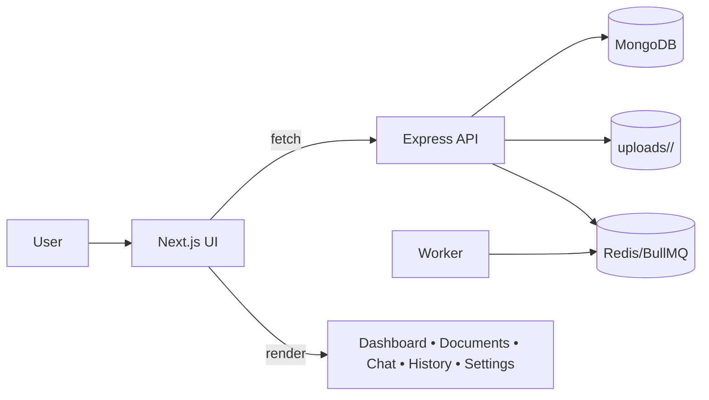
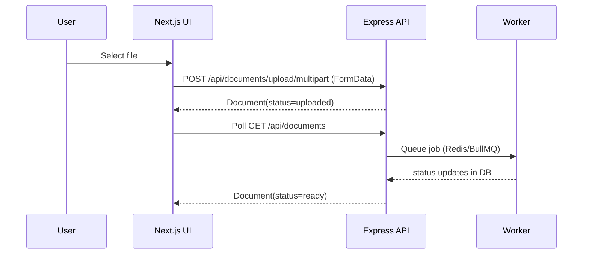
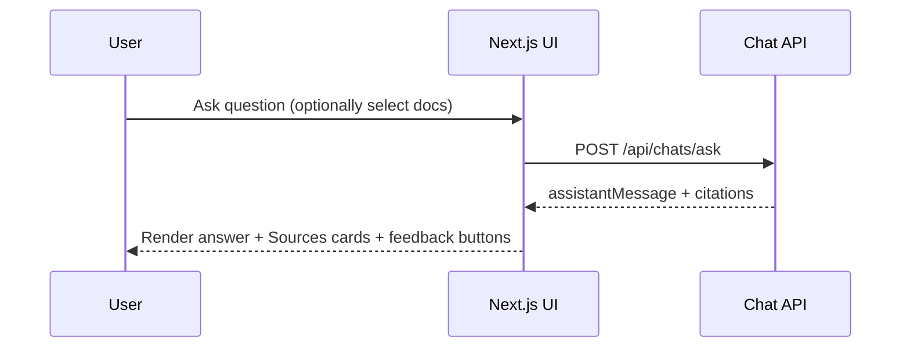

# DocuMind — Frontend

Web application for **DocuMind**, a multi-user document intelligence product: upload PDFs, Word, and PowerPoint files, wait for background processing, then chat with **grounded answers** and **source citations**. Built for the Trao Full-Stack AI Engineering assessment.

**Pair with:** [documind-server](../documind-server) (REST API). If you cloned only this repo, add the backend separately and point `NEXT_PUBLIC_API_URL` at it.

### Live deployment (production)

| | URL |
|--|-----|
| **Web app** | [https://documind.enrolbee.com/](https://documind.enrolbee.com/) |
| **API** | [https://api.documind.enrolbee.com/](https://api.documind.enrolbee.com/) |

Production env example: **`NEXT_PUBLIC_API_URL=https://api.documind.enrolbee.com`** (no trailing slash). The API must allow **`https://documind.enrolbee.com`** in **`CORS_ORIGINS`**.

---

## Project overview

This frontend provides the full end-user experience for DocuMind:

- Authenticated workspace (dashboard shell)
- Document upload + status tracking
- Grounded chat with citations + feedback
- Conversation history
- Settings (profile + account deletion)

---

## Chosen tech stack (and why)

| Layer | Choice |
|--------|--------|
| Framework | **Next.js** (App Router), **React 19**, **TypeScript** |
| Styling | **Tailwind CSS**, shadcn-style UI primitives |
| Auth | JWT access + refresh; tokens in `localStorage`, session cookie for route guards |
| Data | Native `fetch` wrapper in `src/services/api.ts` (auto-refresh on 401) |

Why these choices:

- **Next.js App Router**: clean routing + layouts for a dashboard-style app.
- **TypeScript**: safer API DTO integration and fewer runtime errors.
- **Tailwind**: fast responsive UI and consistent design system.

---

## High-Level Architecture (Frontend)



---

## What’s implemented

- **Auth** — Login, signup, protected dashboard routes, session bootstrap via `GET /api/auth/me`
- **Documents** — List, upload (**multipart** `FormData` preferred; JSON base64 still supported), delete, status polling (`uploaded` → `processing` → `ready` / `failed`), worker health strip
- **Chat** — Document sidebar (desktop) + **mobile sheet** picker, “Search all” vs selected docs, suggested questions from API, citations, thumbs up/down on assistant messages
- **History** — Conversation list → resume chat with `?chatId=`
- **Dashboard** — Live stats from documents + chats (no mock data)
- **Settings** — Profile update (`PUT /api/auth/profile`), account deletion (`POST /api/auth/account/delete` with password)
- **UX** — Responsive layout, `dvh` / safe-area aware shell, accessible controls

---

## Prerequisites

- **Node.js** 20+ (LTS recommended)
- **Backend** running with MongoDB (see server README)

---

## Setup

### 1. Install

```bash
npm install
```

### 2. Environment

Create **`.env.local`** in this directory:

```env
NEXT_PUBLIC_API_URL=http://localhost:5000
```

For production use **`https://api.documind.enrolbee.com`** (or your own API host), with no trailing slash.

#### What this env var does (frontend-oriented)

- **`NEXT_PUBLIC_API_URL`**: where the browser calls the backend. This powers the entire UX:
  - **Upload** → `POST /api/documents/upload/multipart`
  - **Processing status** → `GET /api/documents` + `GET /api/documents/processing/health`
  - **Chat** → `POST /api/chats/ask` and history endpoints
  - **Auth** → register, login, refresh, profile, account delete

Use your deployed API origin in production (no trailing slash).

### 3. Run (development)

```bash
npm run dev
```

Open [http://localhost:3000](http://localhost:3000). Ensure the API is up on the URL above.

### 4. Production build

```bash
npm run build
npm start
```

---

## Setup (deployed)

Typical deployment is **Vercel (frontend)** + **Render/Railway/Fly (API + worker)** + **MongoDB Atlas + Redis**.

**DocuMind production:** app at [https://documind.enrolbee.com/](https://documind.enrolbee.com/), API at [https://api.documind.enrolbee.com/](https://api.documind.enrolbee.com/).

Frontend checklist:

- Set **`NEXT_PUBLIC_API_URL`** to the deployed API origin (HTTPS, no trailing slash).
- Ensure the backend **`CORS_ORIGINS`** includes your frontend origin (e.g. `https://documind.enrolbee.com`).

---

## Project layout (high level)

```
src/
  app/                 # App Router: pages, layouts, middleware
  components/          # Shared UI, layout (sidebar, navbar), auth shell
  features/            # Feature screens: chat, documents, dashboard, history, settings, auth
  services/api.ts      # Typed API client
  store/auth-storage.ts
  types/api.ts         # DTOs shared with API responses
```

---

## Deploying (e.g. Vercel)

1. Set **`NEXT_PUBLIC_API_URL`** to your public API base URL (HTTPS), e.g. **`https://api.documind.enrolbee.com`** for the live stack.
2. Ensure the **server** allows your site origin in **`CORS_ORIGINS`** (e.g. **`https://documind.enrolbee.com`**).
3. Same-site cookies: session cookie is `SameSite=Lax`; use HTTPS everywhere in production.

---

## Frontend flow (User action → Result)

### Upload → Processing → Ready



### Chat (grounded answer + citations)



---

## Authentication and authorization approach (UI)

- Session is bootstrapped by calling `GET /api/auth/me` on app load (dashboard shell).
- API client auto-refreshes access token on `401` using `POST /api/auth/refresh` when possible.
- Routes inside the dashboard require an authenticated session; unauthenticated users are redirected to login.
- The UI never directly accesses other users’ data; all isolation is enforced server-side.

---

## AI agent design and purpose (UX)

- The chat UI is designed to keep answers **grounded**:
  - users can pick documents or use “Search all”
  - answers show **Sources** cards with document name + snippet
  - users can give feedback (thumbs up/down) per answer

---

## Creative/custom feature

- **Feedback loop** on assistant messages (persisted)
- **Dynamic suggested questions** (from backend)
- **Mobile-friendly doc picker** (Sheet) and responsive layouts across pages

---

## Key design decisions and trade-offs

- Prefer **multipart upload** for efficiency; JSON base64 remains as a fallback integration option.
- Keep UI responsive and robust with polling while ingestion is processing (simple and reliable for an assessment build).

---

## Known limitations

- No in-browser rendering for DOCX/PPTX; uploaded files are managed and used for retrieval, but “preview” is not exposed as a viewer in this build.

---

## Scripts

| Command | Purpose |
|---------|---------|
| `npm run dev` | Dev server (Turbopack) |
| `npm run build` | Production build |
| `npm run start` | Serve production build |
| `npm run lint` | ESLint |

---

## Full-system docs

For architecture diagrams, auth model, RAG behavior, and API surface, see the **[repository root README](../README.md)** (if this repo lives inside a monorepo).
